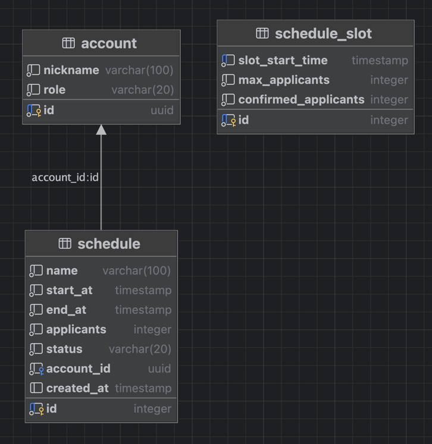

# 그렙 시험 예약 시스템 과제

## 환경 설정 방법

### 구동 환경
아래의 환경에서 구동테스트가 완료되었습니다. 작동하지 않을시 아래 버전을 사용해서 다시 시도해주세요.
- Python:3.12.9
  - 3.13.x 버전 사용시 ORM 버그 발생으로 사용금지
- postgreSQL:17.4
- docker:20.10.17
- docker-compose:1.29.2

### 환경 변수
`.env` 파일의 내용을 수정하여 설정을 변경할 수 있습니다.

- 데이터베이스 관련 정보
    - 기존에 존재하는 postgresql 사용할경우 변경 필수!!
    - `POSTGRES_SERVER`: 접속 url host 주소, 도커 컴포즈 사용시 `db`로 설정!!!
    - `POSTGRES_PORT`: 접속 포트
    - `POSTGRES_USER`: 접속 계정명
    - `POSTGRES_PASSWORD`: 접속 계정 비밀번호
    - `POSTGRES_DB`: 접속할 데이터베이스 이름
    - 생성된 접속 URL 예시: postgresql+asyncpg://{POSTGRES_USER}:{POSTGRES_PASSWORD}@{POSTGRES_SERVER}:{POSTGRES_PORT}/{POSTGRES_DB}
- `ENVIRONMENT`: `local` | `prod`
    - `local` 인경우에만 데이터베이스 쿼리가 로깅으로 생성됨
- 인증
    - `ACCESS_TOKEN_EXPIRE_MINUTES`: 테스트용으로 생성되는 jwt 토큰의 만료시간
    - `SECRET_KEY`: jwt 토큰 생성시 사용되는 시크릿 키
- `DOCS_URL`: API 문서 접속 링크 url
- `BACKEND_EXTERNAL_PORT`: 도커 컴포즈로 구동시 서버가 노출될 포트번호
- 
## 구동방법
로컬 파이썬 환경과 기존에 존재하는 postgresql을 사용한 구동하는 방법과 docker-compose를 사용한 구동하는 방법이 있습니다.

### 로컬에서 직접 구동
```bash
# 3.12.9 버전에서 구동 추천
python --version

# 필요시 가상환경 생성하여 구동
python -m venv venv
source venv/bin/activate

# 라이브러리 설치
pip install -r requirements.txt

# 서버 구동 `http://localhost:8000`로 접속
uvicorn app.main:app --workers 1 --host 0.0.0.0 --port 8000

# 테스트 실행
pytest
```
### docker-compose로 구동
```bash
# 도커 컴포즈 실행파일 실행 관련 파일들 실행권한 부여
chmod +x ./script/*

# 서버 구동 `http://localhost:8000`로 접속
./script/docker_compose_run.sh

# 서버 종료
./script/docker_compose_down.sh

# 테스트 구동
./script/docker_compose_test.sh

# 테스트 종료
./script/docker_compose_down.sh
```
## API 문서
- 서버 구동 후 http://localhost:8000/docs 로 접속하여 swagger UI 확인 가능

## 프로젝트 구성

### 사용 라이브러리
- `fastapi`, `uvicorn`: 웹 프레임워크
- `pydantic`: 데이터 검증 및 json 직렬화, 역직렬화
- `pydantic_settings`: 환경변수 설정
- `sqlmodel`: ORM
- `asyncpg`: 비동기 postgresql
- `greenlet`: 비동기, sqlmodel+asyncpg 사용시 에러가 발생하여 사용
- `pyjwt`: jwt 토큰 파싱및 생성
- `pytest`: 테스트

### 디렉토리 구조
```plaintext
.
├── app
│   ├── api: API 라우팅, API 정의, 요청 응답 처리
│   ├── common: 환경변수설정, 인증필터 및 jwt처리, 예외처리
│   ├── doc: swagger문서, API 응답 에러메세지 관리
│   ├── services: 비지니스 로직 처리
│   │   └── models: service 작동을 보조하기위한 도구로 사용되는 것들
│   ├── storage: 데이터베이스 관련 CURD 작업
│   │   └── models: 데이터베이스 테이블에 대응되는 SQLModel
│   ├── tests/api: 주요 요구사항에 대한 api 테스트
│   ├── dependencies.py
│   └── main.py 
```

### 데이터 베이스 테이블 구조


- account: 사용자 정보 및 권한 저장
- schedule: 예약정보 및 상태 저장
- schedule_slot: 시간별 최대 예약 가능 인원 저장


